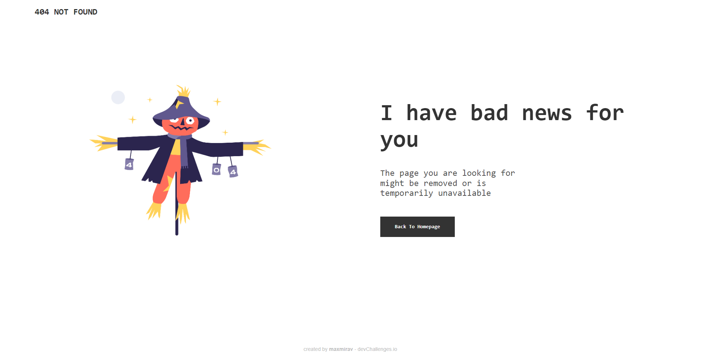

<!-- Please update value in the {}  -->

<h1 align="center">404 Not Found Page - DevChallenge Solution</h1>

   Solution for a challenge from  <a href="http://devchallenges.io" target="_blank">Devchallenges.io</a>.

  <h3>
    <a href="https://maxmirav.github.io/DevChallenge-404-not-found/">
      Demo
    </a>
     | 
    <a href="https://github.com/maxmirav/DevChallenge-404-not-found">
      Solution
    </a>
     | 
    <a href="https://devchallenges.io/challenges/wBunSb7FPrIepJZAg0sY">
      Challenge
    </a>
  </h3>

<!-- TABLE OF CONTENTS -->

## Table of Contents

- [Overview](#overview)
  - [Built With](#built-with)
- [Features](#features)
- [Contact](#contact)
- [Acknowledgements](#acknowledgements)

<!-- OVERVIEW -->

## Overview

Was dipping my toes into Flexbox again. Had to relearn a lot of things since I haven't done any web programming at all for the last six months. 

Used a lot of percentages(%) when it comes to sizes and spacings, plus I'm pretty sure I have a lot of unnecessary CSS in there, but I think I did okay.

### Built With

<!-- This section should list any major frameworks that you built your project using. Here are a few examples.-->

- [Flexbox](https://css-tricks.com/snippets/css/a-guide-to-flexbox/)

## Features

<!-- List the features of your application or follow the template. Don't share the figma file here :) -->

This application/site was created as a submission to a [DevChallenges](https://devchallenges.io/challenges) challenge. The [challenge](https://devchallenges.io/challenges/wBunSb7FPrIepJZAg0sY) was to build an application to complete the given user stories.

## Acknowledgements

<!-- This section should list any articles or add-ons/plugins that helps you to complete the project. This is optional but it will help you in the future. For exmpale -->

- [Steps to replicate a design with only HTML and CSS](https://devchallenges-blogs.web.app/how-to-replicate-design/)
- [Kevin Powell's Responsive Design course](https://courses.kevinpowell.co/conquering-responsive-layouts)

## Contact

- Website [your-website.com](https://maxmirav.github.io/)
- GitHub [@your-username](https://github.com/maxmirav)
- Twitter [@your-twitter](https://twitter.com/MaxMiravite)
